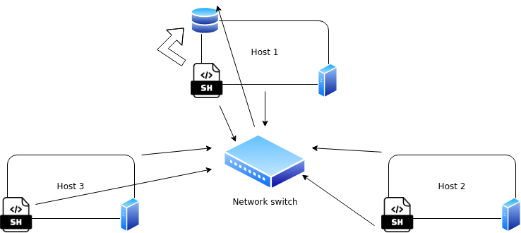

# Linux Cluster Monitoring Agent

# Introduction
The purpose of this cluster monitoring project is to provide the LCA team at Jarvis with a means of recording the hardware specifications of a Rocky Linux server(s), as well as getting real-time updates on its resource usage. The collected data will then be stored in a PostgreSQL database, providing the LCA team with data to generate reports for the purposes of planning how to allocate and distribute resources in the future. Technologies used to deliver this project include the likes of PSQL, Bash, Docker, and Git.

# Quick start
Here are some quick start commands to get you up to speed on using the host monitoring agent:
```shell

# create/start a psql instance + docker container using psql_docker.sh script
bash scripts/psql_docker.sh create postgres password
bash scripts/psql_docker.sh start
# create host_info and host_usage tables using ddl.sql
sql/ddl.sql
# insert hardware specs into RDBMS using host_info.sh
bash scripts/host_info.sh localhost port_no db_name db_user db_password
# insert hardware usage info into RDBMS using host_usage.sh
bash scripts/host_usage.sh localhost port_no db_name db_user db_password
# setup crontab job to automate host_usage.sh to collect data every minute and append to log file
crontab -e
* * * * * bash absolute/path/scripts/host_usage.sh localhost port_no db_name db_user db_password >> /tmp/host_usage.log 
```

# Implementation

## Architecture


## Scripts
Below is a description and sample usage of each of the scripts relevant to this project:
<br>
<br>
`psql_docker.sh`: Creates the jrvs-psql Docker container if not already, otherwise starts/stops the container according to user input.
<br>
Example usage:
```shell

# create docker instance
psql_docker.sh create db_username db_password
# stop instance
psql_docker.sh stop
# start instance up again
psql_docker.sh start
```

`host_info.sh`: Receives database credentials as arguments, then inserts system hardware specifications into a PSQL RDBMS.
<br>
Example usage:
```shell

host_info.sh localhost 1234 db_name db_user db_password
```

`host_usage.sh`: Receives database credentials, and records node resource usage information in real time, then writes it to the PSQL RDBMS.
<br>
Example usage:
```shell

host_usage.sh localhost 1234 db_name db_user db_password
```

`crontab`: Used for deployment and automation, since we want continuous updates.
<br>
Example usage:
```shell

* * * * * bash /home/rocky/dev/jarvis_data_eng_AlanHu/linux_sql/scripts/host_usage.sh localhost 1234 host_agent postgres password >> /tmp/host_usage.log
```

## Database Modeling
Below are the schemas of the two PSQL databases that will hold our Linux node information:
<br>
<br>
`host_info`:

| Column name      | Type      | Description                                 |
|------------------|-----------|---------------------------------------------|
| id               | SERIAL    | Host id; auto-incrementing                  |
| hostname         | VARCHAR   | Host name                                   |
| cpu_number       | INT2      | Number of CPU processors                    |
| cpu_architecture | VARCHAR   | CPU architecture type                       |
| cpu_model        | VARCHAR   | CPU model                                   |
| cpu_mhz          | FLOAT8    | CPU clock speed (MHz)                       |
| l2_cache         | INT4      | Amount of L2 cache available                |
| timestamp        | TIMESTAMP | Timestamp of when information was extracted |
| total_mem        | INT4      | Total memory available on root disk         |

`host_usage`:

| Column name    | Type      | Description                                                     |
|----------------|-----------|-----------------------------------------------------------------|
| timestamp      | TIMESTAMP | Timestamp (UTC) of when resource usage information was captured |
| host_id        | SERIAL    | Host id; auto-incrementing                                      |
| memory_free    | INT4      | Amount of memory free at the moment command was run             |
| cpu_idle       | INT2      | Percentage of time CPU was idle                                 |
| cpu_kernel     | INT2      | Percentage of CPU time spent running kernel/system processes    |
| disk_io        | INT4      | Number of blocks written to disk/second                         |
| disk_available | INT4      | Available disk space on root filesystem                         |

# Testing
To test the creation of the `ddl.sql` script, I ran the script manually from the command line. I then logged into the PSQL server and connected to the `host_agent` database to check if the script was successful in connecting to the database and creating the tables, which it was.
<br>
<br>
Afterwards, to verify whether the host monitoring scripts (`host_info.sh`, `host_usage.sh`) worked properly on their own, I ran them both manually. First was `host_info.sh`, since the latter required a host_id from the `host_info` table to complete the subquery when inserting data. Thus, `host_info.sh` was run first to ensure that the hardware specifications, including the host_id, were stored in the database, after which `host_usage.sh` was run to check whether host usage data was being written to the database. Both scripts were successful, and ran smoothly without any errors or logical hiccups. 

# Deployment
The host monitoring agent was deployed with the use of crontab, Docker, and GitHub:
- <b>crontab:</b> Automated the execution of the `host_usage.sh` script, as we want to collect usage data every minute to generate accurate, insightful reports
- <b>Docker:</b> Docker was used to containerize the app, and thus make it compatible to run on any device, no setup required
- <b>GitHub:</b> GitFlow workflow was used throughout the entirety of the project to help maintain version control, ensuring that features are merged with an intermediary development branch, before finally being pushed to production once all changes were approved

# Improvements
As is with all things development, there are always features that could be improved, steps that could be taken to make the app better, etc. As such, here are a few things that I might implement if I had another go-around at this project, that would hopefully improve and build upon the features implemented currently:
- We could potentially automate the execution of `host_info.sh` to run every month, for example, to account for any potential hardware upgrades or changes to the VM. This way, future reports could focus on usage differences between different hardware specifications to identify any changes that need to be made.
- Although the Jarvis LCA will be generating reports in an "end-of-project" fashion, it might also be beneficial to have a script that, for example, collects and aggregates usage data for every hour, and delivers a report to an executive's inbox. A script like this could also make us of crontab automation, and would also help detect any unprecedented changes in system usage on an hourly basis, which could be indicative of a much deeper issue that needs immediate attention.
- Lastly, as a potential security measure, we could save our database credentials as permanent variables within our linux system. That way, even if an attacker gets ahold of the crontab file, they cannot perform harmful injections or operations into the database. Currently, the database credentials are being passed in through the command that is visible in the crontab job file.