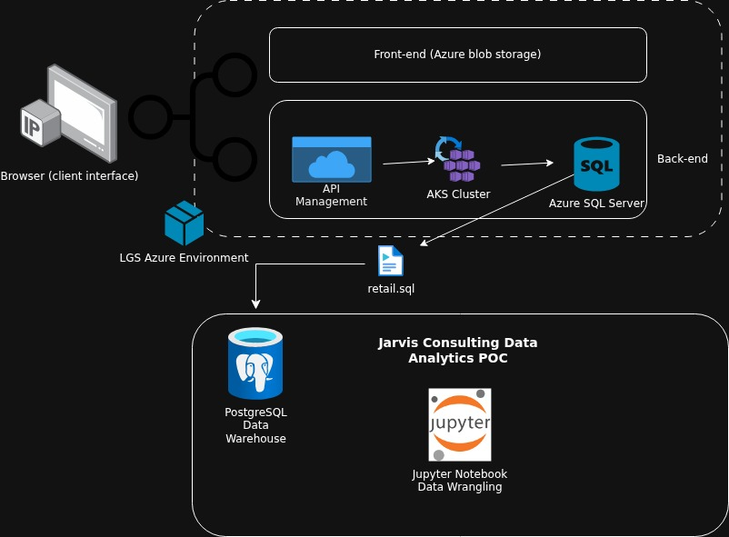

# Introduction
The premise here is that LGS has been experiencing stagnant revenue, despite having been operating e-commerce for more than 10 years. The LGS marketing team wishes to uncover potential points of attack that they can exploit in terms of attracting new customers, and keeping existing customers. They will base their actions on the outcomes of our analysis via Jupyter Notebook and several core Python analysis libraries, such as Pandas. The LGS data is stored in a PostgreSQL data warehouse, which we connect to through our notebook.

# Implementation
## Project Architecture
- Since we are only providing a proof of concept, it makes sense that we are not allowed to work within LGS' own Azure environment to perform our analytics
- To circumvent this, LGS have dumped their data into a `retail.sql` file
- Jarvis then loads the file into their own data warehouse, which is accessed through their Jupyter Notebook, allowing us to perform our analysis

## Data Analytics and Wrangling
[Link to notebook](./retail_data_analytics_wrangling.ipynb)
- Discuss how would you use the data to help LGS to increase their revenue (e.g. design a new marketing strategy with data you provided)
- Data indicates that sales have seasonal peaks around November across all years - which is to be expected due to Black Friday + preparing for Christmas
  - Marketing team might consider offering promotions more regularly throughout the year to increase volume of sales during off-peak times
- Likewise, the plots corresponding to monthly customers/new + returning customers also seems to follow a similar trend
- Also, based on our customer segmentation plot, there is ~700-750 each of Potential Loyalist/At Risk customers
  - So, it would seem that another great way to drive revenue would be to attract lots of new customers, and/or find a way to convert customers who shop semi-often to loyal, frequently visiting customers. One way to do so that I've experienced personally is to offer some sort of visit X times, get Y free incentive. Whereas normally, customers might be hesitant to shop more often, this new incentive now provides a reason to do so, provided that whatever "Y" it is they're offering is worthwhile.  
  - For example, as LGS is gift shop, and a lot of its customers are wholesalers, they could offer something along the lines of "Make 5 purchases, and receive 40% off your next order"
  - Could even do something like free shipping, etc

# Improvements
1. Although I'm pursuing the Data Engineering stream, it might prove helpful to prepare a high-level presentation for LGS executives with all the recommendations derived from my analysis.
2. Plots would benefit from more informative axis labels (e.g. "Invoice month" instead of "YYYYMM").
3. Dataframe organization is all over the place; i.e. create one dataframe that has invalid orders removed, then copy that for each task, rather than re-do the removal of invalid orders for multiple tasks.